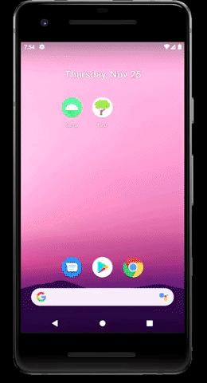
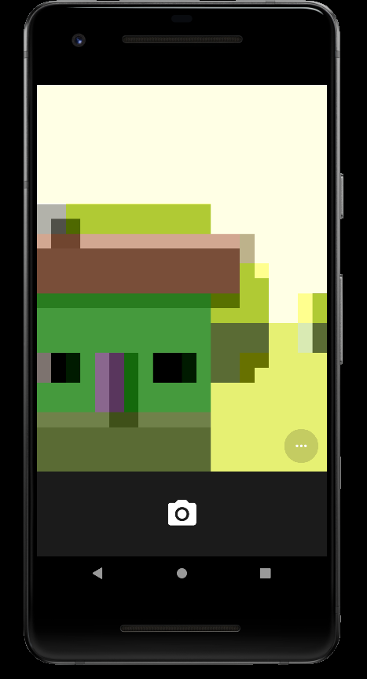
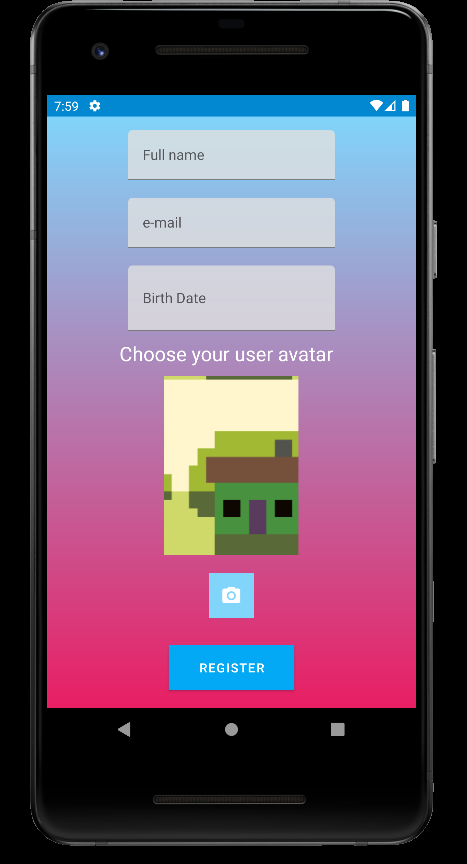

# First 
## An interfaces development project

This application has the following parts:
* Splash screen
* Login screen
* Register screen
* Main screen
  
## Splash screen

This first creen is thought as a welcoming screen for the user, showing the application logo with an animation to welcome the user in an apropiate way. After 1 second, the application will start automaticaly leading the user to the login screen.

## Login Screen 

In thiss creen we are going to let the user login into our application or register in it. For that we have two fields in witch the user can introduce his username, and his pasword in order to login.

We also have two buttons, one to confirm the login, and another to lead the user into the register screen in case he/she doesn't have an account.

This screen also shows the application logo in the front

## Register Screen 

 

In this screen we have an scroll layout to contain all the fields necesary to the user to register. The user will have to complete all the fields and finally click the button register to perform the register.

The birth date field has a calendar incorporated as you click it in order to select your own birthdate to register

Also in order to register, the user will have to upload his/her user avatar, in order to facillitate that we have the options to click the camera buton, which will open the camera of the device and the user would take a photo of himself and choose it as his/her user avatar

 

## Main screen

As the user finally loged in, he/she will have access to the main screen of the application, which consist in a swipe layout to refresh the photo in the background, which will change into another photo of a person that doesn't exist.

If we long press the image a contextual menu will appear

If we click the key button another menu will appear in orther to let the user log out, or go to the register screen to crate a new account

